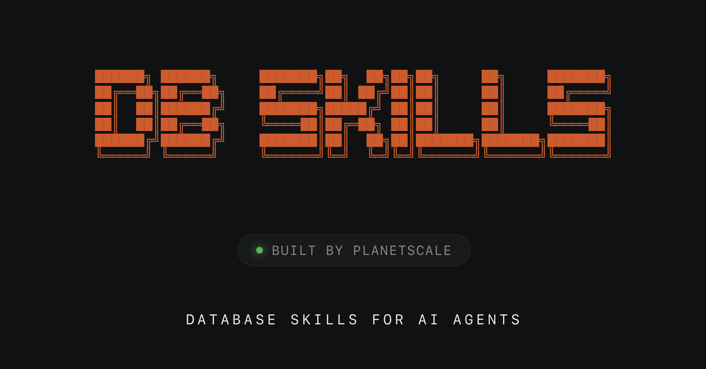

# Database Skills



Database-focused skills for AI coding assistants. Each skill lives in its own sub-directory under `skills/` and covers a specific database technology.

## Installation

```bash
npx skills add planetscale/database-skills
```

see [skills.sh](https://skills.sh) for more info.

## Available Skills

### mysql

Plan and review MySQL/InnoDB schema, indexing, query tuning, transactions, and operations. Use when creating or modifying MySQL tables, indexes, or queries; diagnosing slow or locking behavior; planning migrations; or troubleshooting replication and connection issues.

### neki

Overview and guidance for Neki, PlanetScale's sharded Postgres product. Use when working with Neki-related tasks or evaluating how to scale and shard Postgres.

### postgres

PostgreSQL best practices, query optimization, connection troubleshooting, and performance insights for PlanetScale Postgres. Use when working with PlanetScale PostgreSQL databases — schema design, indexing, MVCC/VACUUM, WAL tuning, replication, monitoring, or PlanetScale-specific features like connection pooling and CLI insights.

### vitess

Vitess best practices, query optimization, and connection troubleshooting for PlanetScale Vitess databases. Use when working with sharding, VSchema configuration, keyspace management, online DDL, VReplication, or MySQL-compatible scaling issues.

## Repo Structure

```
database-skills/
├── README.md
└── skills/
    ├── mysql/
    │   ├── SKILL.md
    │   └── references/
    ├── neki/
    │   ├── SKILL.md
    │   └── references/
    ├── postgres/
    │   ├── SKILL.md
    │   └── references/
    └── vitess/
        ├── SKILL.md
        └── references/
```

Each skill is a sub-directory under `skills/` containing:

- **SKILL.md** — Required. Instructions, triggers, and workflow for the skill.
- **references/** — Optional. Supporting documents loaded into context as needed.

## Contributing

1. Fork this repo
2. Create a new skill directory under `skills/`
3. Add a `SKILL.md` and optional `references/`
4. Submit a PR
